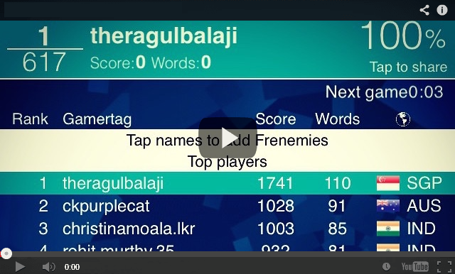

# WordamentBot
Win at Wordament / Boggle consistently

## Watch it in action!
<a href="http://www.youtube.com/watch?feature=player_embedded&v=moXRIxvnP3E" target="_blank" ></a>

- Requires Java SE > 5
- Android emulator scaled and positioned appropriated on screen
- Wordament App Installed on the emulator
- Preferably latest Eclipse IDE

```java
Run WordRun.java and the rest should be self explainatory.
Word List is contained in words.txt
```
Ragul Balaji (C) Written sometime in 2014
